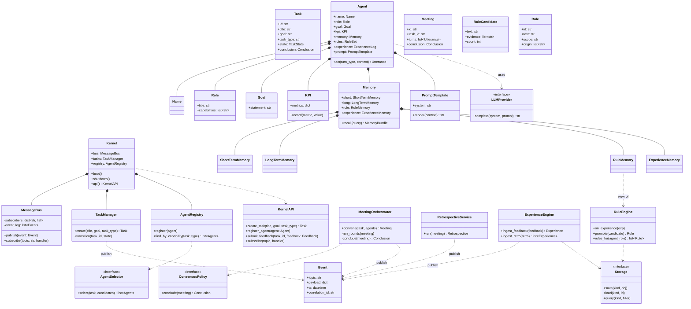
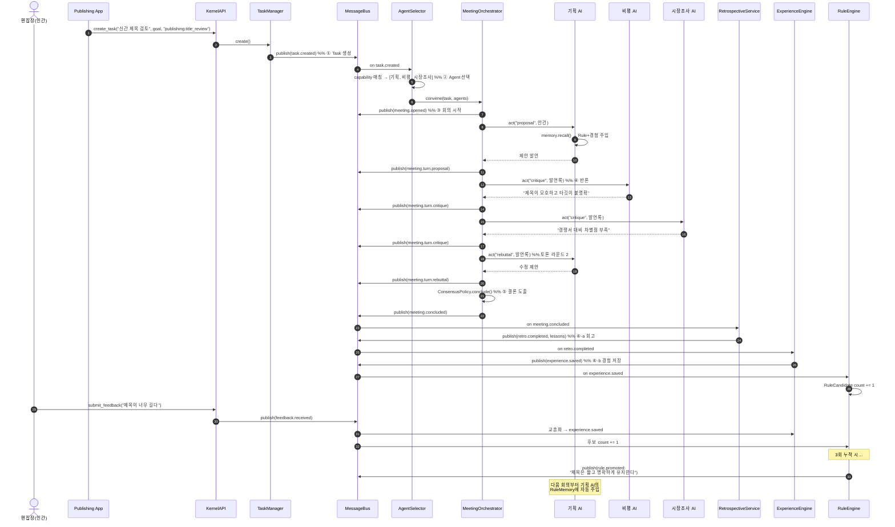

# AIOS Kernel v0.1 — 설계 문서

> **AIOS는 AI를 호출하는 프로그램이 아니다. AI 조직을 운영하는 운영체제다.**
>
> 게임회사, 출판사, 연구소, 방송국은 모두 AIOS 위에서 실행되는 **App(조직)**이다.
> 이 문서는 그 위에 아무것도 없는, 가장 작은 **Kernel**만을 설계한다.

---

## 0. 설계 원칙 (읽고 시작할 것)

| 원칙 | Kernel에서의 적용 |
|---|---|
| **커널 최소주의** | 커널은 콘텐츠를 만들지 않는다. Task / Agent / 회의 / 결론 / 회고 / 경험 — 6가지 시스템콜만 제공한다. |
| **Event Driven** | Agent는 서로를 절대 직접 호출하지 않는다. 모든 상호작용은 **MessageBus**를 통과한다. |
| **SOLID** | 모든 외부 의존(LLM, 저장소, 합의정책)은 **추상 인터페이스** 뒤에 숨긴다. 커널은 구현체를 모른다. |
| **Experience ≠ 학습** | Experience는 모델 가중치 학습이 아니다. **편집장(인간)의 피드백이 조직의 Rule로 승격되는 과정**이다. |
| **App = 사용자 공간** | 출판사, 게임 스튜디오는 커널을 수정하지 않는다. Plugin API로 Agent와 이벤트 핸들러를 **등록**할 뿐이다. |

OS 비유표:

| 전통 OS | AIOS Kernel |
|---|---|
| Process | Task |
| Scheduler | AgentSelector |
| IPC / Syscall | MessageBus (Event) |
| Driver | LLMProvider (교체 가능) |
| Filesystem | MemoryStore (SQLite/JSON) |
| /etc 설정 | Rule DB |
| Syslog + Postmortem | Retrospective + ExperienceEngine |
| Userland Program | Organization App (Publishing, GameStudio…) |

---

## 1. Kernel Architecture

```
┌──────────────────────────────────────────────────────────────────┐
│                        USER SPACE (Apps)                         │
│   ┌──────────────┐  ┌──────────────┐  ┌──────────────┐           │
│   │ Publishing   │  │ Game Studio  │  │ Research Lab │  ...      │
│   │ App          │  │ App          │  │ App          │           │
│   └──────┬───────┘  └──────┬───────┘  └──────┬───────┘           │
│          │  register_agent / create_task / subscribe             │
├──────────┴─────────────────┴─────────────────┴───────────────────┤
│                      KERNEL API (Syscalls)                       │
│   create_task · select_agents · convene · conclude ·             │
│   retrospect · save_experience                                   │
├──────────────────────────────────────────────────────────────────┤
│                          KERNEL CORE                             │
│                                                                  │
│  ┌────────────┐   ┌──────────────────────────────────────┐       │
│  │  Task      │   │            MESSAGE BUS               │       │
│  │  Manager   ├──▶│   (pub/sub · topic · event log)      │       │
│  └────────────┘   └──▲────────▲────────▲────────▲────────┘       │
│                      │        │        │        │                │
│  ┌────────────┐  ┌───┴────┐ ┌─┴──────┐ ┌┴──────────┐             │
│  │ Agent      │  │Meeting │ │Retro-  │ │Experience │             │
│  │ Registry + │  │Orches- │ │spective│ │Engine     │             │
│  │ Selector   │  │trator  │ │Service │ │+RuleEngine│             │
│  └────────────┘  └────────┘ └────────┘ └───────────┘             │
├──────────────────────────────────────────────────────────────────┤
│                      DRIVER / HAL LAYER                          │
│  ┌──────────────────┐        ┌───────────────────────┐           │
│  │ LLMProvider(ABC) │        │ Storage(ABC)          │           │
│  │  · MockProvider  │        │  · SQLiteStorage      │           │
│  │  · AnthropicPrv  │        │  · JsonFileStorage    │           │
│  └──────────────────┘        └───────────────────────┘           │
└──────────────────────────────────────────────────────────────────┘
```

핵심 규칙 3가지:

1. **커널 코어의 어떤 모듈도 다른 모듈을 import해서 직접 호출하지 않는다.** 오직 Bus에 이벤트를 발행하고, 관심 있는 토픽을 구독한다. (Meeting이 끝나면 `MEETING_CONCLUDED`를 발행할 뿐, RetrospectiveService를 부르지 않는다.)
2. **Agent는 커널 안에서 "수동적 존재"다.** Agent는 스스로 행동하지 않는다. MeetingOrchestrator가 발언권(turn)을 줄 때만 `act()` 한다. — 이것이 스케줄러다.
3. **LLM 호출은 Driver다.** 커널 v0.1은 `MockProvider`만으로 완전히 동작·테스트 가능해야 한다.

### 이벤트 카탈로그 (Kernel v0.1 표준 토픽)

```
task.created            → AgentSelector가 구독
task.assigned           → MeetingOrchestrator가 구독
meeting.opened          → (로그/앱 훅)
meeting.turn.proposal   → 발언 1건 (기획)
meeting.turn.critique   → 반론 1건 (비평)
meeting.turn.rebuttal   → 재반론 1건
meeting.concluded       → RetrospectiveService가 구독
retro.completed         → ExperienceEngine이 구독
feedback.received       → (편집장 인간 피드백) ExperienceEngine이 구독
experience.saved        → RuleEngine이 구독 (Rule 후보 카운팅)
rule.candidate.created  → (로그/앱 훅)
rule.promoted           → 전 Agent의 RuleMemory 갱신
```

---

## 2. Class Diagram



SOLID 매핑:

- **S**: TaskManager는 상태전이만, Orchestrator는 회의 진행만, RuleEngine은 승격만 담당.
- **O**: 새로운 회의 방식은 `ConsensusPolicy` 구현체 추가로 확장 (커널 수정 없음).
- **L**: `MockProvider`와 `AnthropicProvider`는 어디서든 치환 가능.
- **I**: Agent가 커널 전체를 알 필요 없음 — `LLMProvider`, `MemoryBundle`만 주입받음.
- **D**: 커널 코어는 `Storage(ABC)`, `LLMProvider(ABC)`에만 의존. SQLite/JSON은 부팅 시 주입.

---

## 3. Directory 구조

```
aios/
├── pyproject.toml
├── README.md
├── aios/
│   ├── __init__.py
│   ├── kernel/                      # ★ 커널 코어 — App은 절대 수정 금지
│   │   ├── __init__.py
│   │   ├── kernel.py                # Kernel, KernelAPI (부팅/시스템콜)
│   │   ├── bus.py                   # MessageBus, Event, Topics
│   │   ├── task.py                  # Task, TaskState, TaskManager
│   │   ├── agent.py                 # Agent + Name/Role/Goal/KPI/Prompt
│   │   ├── selector.py              # AgentSelector(ABC) + CapabilitySelector
│   │   ├── meeting.py               # MeetingOrchestrator, Meeting, Utterance
│   │   ├── consensus.py             # ConsensusPolicy(ABC) + ChairDecides
│   │   ├── retrospective.py         # RetrospectiveService
│   │   ├── experience.py            # ExperienceEngine, Feedback, Experience
│   │   ├── rules.py                 # RuleEngine, Rule, RuleCandidate
│   │   └── memory/
│   │       ├── __init__.py
│   │       ├── base.py              # MemoryLayer(ABC), MemoryBundle
│   │       ├── short.py             # ShortTermMemory
│   │       ├── long.py              # LongTermMemory
│   │       ├── rule_mem.py          # RuleMemory
│   │       └── experience_mem.py    # ExperienceMemory
│   ├── drivers/                     # HAL — 교체 가능한 외부 세계
│   │   ├── __init__.py
│   │   ├── llm/
│   │   │   ├── base.py              # LLMProvider(ABC)
│   │   │   ├── mock.py              # MockProvider (v0.1 기본값)
│   │   │   └── anthropic_.py        # 실제 LLM 드라이버 (선택)
│   │   └── storage/
│   │       ├── base.py              # Storage(ABC)
│   │       ├── sqlite_store.py
│   │       └── json_store.py
│   ├── plugin/                      # Plugin SDK (App 개발자용)
│   │   ├── __init__.py
│   │   └── app.py                   # OrgApp(ABC), AppManifest
│   └── apps/                        # 사용자 공간 (커널이 아님!)
│       ├── publishing/              # 출판사 App (예시 스텁)
│       │   ├── manifest.py
│       │   └── agents.py
│       └── gamestudio/              # 게임 스튜디오 App (예시 스텁)
│           ├── manifest.py
│           └── agents.py
├── data/
│   ├── aios.db                      # SQLite (기본)
│   └── json/                        # JsonFileStorage 선택 시
└── tests/
    ├── test_bus.py
    ├── test_meeting_flow.py         # 6단계 E2E: Task→회의→결론→회고→경험
    └── test_rule_promotion.py       # 피드백 반복 → Rule 승격
```

> 판별 기준: **"이 코드가 없어도 회의가 열리는가?"** → 열린다면 `apps/`로, 안 열린다면 `kernel/`로.

---

## 4. Python 프로젝트 구조 (핵심 코드)

v0.1은 **단일 프로세스, 동기(synchronous) Bus**로 시작한다. 비동기/분산은 Bus 구현체 교체로 해결한다 (인터페이스 불변).

### 4.1 `kernel/bus.py` — 신경계

```python
from __future__ import annotations
import uuid
from dataclasses import dataclass, field
from datetime import datetime, timezone
from typing import Callable

@dataclass(frozen=True)
class Event:
    topic: str
    payload: dict
    correlation_id: str            # 보통 task_id — 하나의 Task 흐름 추적
    id: str = field(default_factory=lambda: uuid.uuid4().hex)
    ts: datetime = field(default_factory=lambda: datetime.now(timezone.utc))

class Topics:
    TASK_CREATED       = "task.created"
    TASK_ASSIGNED      = "task.assigned"
    MEETING_OPENED     = "meeting.opened"
    TURN_PROPOSAL      = "meeting.turn.proposal"
    TURN_CRITIQUE      = "meeting.turn.critique"
    TURN_REBUTTAL      = "meeting.turn.rebuttal"
    MEETING_CONCLUDED  = "meeting.concluded"
    RETRO_COMPLETED    = "retro.completed"
    FEEDBACK_RECEIVED  = "feedback.received"
    EXPERIENCE_SAVED   = "experience.saved"
    RULE_CANDIDATE     = "rule.candidate.created"
    RULE_PROMOTED      = "rule.promoted"

Handler = Callable[[Event], None]

class MessageBus:
    """동기식 pub/sub. 와일드카드 'task.*' 및 전체 구독 '*' 지원."""
    def __init__(self, storage=None):
        self._subs: dict[str, list[Handler]] = {}
        self._storage = storage          # 이벤트 로그 영속화 (감사/재생용)

    def subscribe(self, topic: str, handler: Handler) -> None:
        self._subs.setdefault(topic, []).append(handler)

    def publish(self, event: Event) -> None:
        if self._storage:
            self._storage.save("events", event)
        for pattern, handlers in self._subs.items():
            if self._match(pattern, event.topic):
                for h in handlers:
                    h(event)             # v0.2: 큐 + 워커로 교체

    @staticmethod
    def _match(pattern: str, topic: str) -> bool:
        if pattern == "*" or pattern == topic:
            return True
        return pattern.endswith(".*") and topic.startswith(pattern[:-1])
```

### 4.2 `kernel/task.py`

```python
import uuid
from dataclasses import dataclass, field
from enum import Enum

class TaskState(str, Enum):
    CREATED    = "created"
    ASSIGNED   = "assigned"
    IN_MEETING = "in_meeting"
    CONCLUDED  = "concluded"
    RETROSPECTED = "retrospected"
    ARCHIVED   = "archived"

@dataclass
class Task:
    title: str
    goal: str
    task_type: str                   # 예: "publishing.title_review"
    id: str = field(default_factory=lambda: uuid.uuid4().hex[:12])
    state: TaskState = TaskState.CREATED
    conclusion: dict | None = None

class TaskManager:
    """시스템콜 #1: Task 생성. 상태전이의 유일한 관문."""
    _LEGAL = {
        TaskState.CREATED:    {TaskState.ASSIGNED},
        TaskState.ASSIGNED:   {TaskState.IN_MEETING},
        TaskState.IN_MEETING: {TaskState.CONCLUDED},
        TaskState.CONCLUDED:  {TaskState.RETROSPECTED},
        TaskState.RETROSPECTED: {TaskState.ARCHIVED},
    }

    def __init__(self, bus, storage):
        self._bus, self._storage = bus, storage
        self._tasks: dict[str, Task] = {}

    def create(self, title: str, goal: str, task_type: str) -> Task:
        task = Task(title=title, goal=goal, task_type=task_type)
        self._tasks[task.id] = task
        self._storage.save("tasks", task)
        from .bus import Event, Topics
        self._bus.publish(Event(Topics.TASK_CREATED,
                                {"task_id": task.id, "task_type": task_type,
                                 "title": title, "goal": goal},
                                correlation_id=task.id))
        return task

    def transition(self, task_id: str, to: TaskState) -> None:
        task = self._tasks[task_id]
        if to not in self._LEGAL[task.state]:
            raise ValueError(f"illegal transition {task.state} -> {to}")
        task.state = to
        self._storage.save("tasks", task)
```

### 4.3 `kernel/agent.py` — Agent 8요소 클래스

```python
from dataclasses import dataclass, field

@dataclass(frozen=True)
class Name:
    value: str

@dataclass(frozen=True)
class Role:
    title: str                        # "기획 AI", "비평 AI"...
    capabilities: list = field(default_factory=list)
    # capabilities: 처리 가능한 task_type 접두어. 예: ["publishing.*"]

@dataclass(frozen=True)
class Goal:
    statement: str                    # "독자가 클릭하고 싶은 기획을 만든다"

@dataclass
class KPI:
    metrics: dict = field(default_factory=dict)   # {"proposal_accept_rate": 0.0}
    def record(self, metric: str, value: float):
        self.metrics[metric] = value

@dataclass(frozen=True)
class PromptTemplate:
    system: str
    def render(self, *, role, goal, rules, memories, context) -> str:
        rule_text = "\n".join(f"- {r}" for r in rules) or "- (없음)"
        mem_text  = "\n".join(f"- {m}" for m in memories) or "- (없음)"
        return (f"{self.system}\n\n[역할] {role}\n[목표] {goal}\n"
                f"[조직 규칙 — 반드시 준수]\n{rule_text}\n"
                f"[관련 기억]\n{mem_text}\n\n[안건]\n{context}")

@dataclass
class Utterance:
    agent_name: str
    turn_type: str                    # proposal | critique | rebuttal
    content: str

class Agent:
    """Agent는 스스로 움직이지 않는다. Orchestrator가 turn을 줄 때만 act()."""
    def __init__(self, name: Name, role: Role, goal: Goal, kpi: KPI,
                 memory, prompt: PromptTemplate, llm):
        self.name, self.role, self.goal, self.kpi = name, role, goal, kpi
        self.memory = memory          # Memory (4계층 파사드)
        self.prompt = prompt
        self._llm = llm               # LLMProvider — DI

    # rules/experience는 소유하지 않고 Memory 계층을 통해 '조회'한다 (단일 진실 원천: RuleEngine/Storage)
    def act(self, turn_type: str, context: str) -> Utterance:
        bundle = self.memory.recall(context)          # 4계층 통합 회상
        rendered = self.prompt.render(
            role=self.role.title, goal=self.goal.statement,
            rules=bundle.rules, memories=bundle.snippets, context=context)
        text = self._llm.complete(system=f"You are {self.name.value}.",
                                  prompt=f"[{turn_type}] {rendered}")
        self.memory.short.add(f"({turn_type}) {text}")
        return Utterance(self.name.value, turn_type, text)

class AgentRegistry:
    def __init__(self):
        self._agents: dict[str, Agent] = {}
    def register(self, agent: Agent):
        self._agents[agent.name.value] = agent
    def find_by_capability(self, task_type: str) -> list[Agent]:
        out = []
        for a in self._agents.values():
            for cap in a.role.capabilities:
                if cap == task_type or (cap.endswith(".*")
                                        and task_type.startswith(cap[:-1])):
                    out.append(a); break
        return out
```

### 4.4 `kernel/selector.py` — 시스템콜 #2: Agent 선택

```python
from abc import ABC, abstractmethod

class AgentSelector(ABC):
    @abstractmethod
    def select(self, task, candidates: list) -> list: ...

class CapabilitySelector(AgentSelector):
    """v0.1 기본: capability 매칭 + 역할 다양성(제안자/비평자 최소 1)."""
    def select(self, task, candidates):
        if not candidates:
            raise LookupError(f"no agent for task_type={task.task_type}")
        return candidates[:5]         # v0.2: KPI 기반 랭킹으로 교체 지점

# 확장 예 (커널 수정 없이 클래스만 추가):
# class KPISelector(AgentSelector): ...   # 성과 좋은 Agent 우선
# class AuctionSelector(AgentSelector): ... # Agent가 입찰
```

### 4.5 `kernel/consensus.py` + `kernel/meeting.py` — 시스템콜 #3·4·5

```python
# consensus.py
from abc import ABC, abstractmethod

class ConsensusPolicy(ABC):
    @abstractmethod
    def conclude(self, meeting, chair_llm) -> dict: ...

class ChairDecides(ConsensusPolicy):
    """v0.1 기본: 전체 발언록을 의장 LLM이 요약·결정."""
    def conclude(self, meeting, chair_llm) -> dict:
        transcript = "\n".join(
            f"[{u.turn_type}] {u.agent_name}: {u.content}" for u in meeting.turns)
        text = chair_llm.complete(
            system="당신은 회의 의장이다. 결론/근거/기각된 대안을 정리하라.",
            prompt=transcript)
        return {"decision": text, "policy": "chair_decides"}

# class MajorityVote(ConsensusPolicy): ...   # 확장 지점
```

```python
# meeting.py
import uuid
from dataclasses import dataclass, field
from .bus import Event, Topics
from .agent import Utterance

@dataclass
class Meeting:
    task_id: str
    participants: list
    id: str = field(default_factory=lambda: uuid.uuid4().hex[:12])
    turns: list = field(default_factory=list)
    conclusion: dict | None = None

class MeetingOrchestrator:
    """회의 = 커널 스케줄러. 발언권을 배분하고 결론을 강제한다.
       라운드: proposal → critique → rebuttal → (반복) → conclude"""
    def __init__(self, bus, storage, policy, chair_llm, max_rounds: int = 2):
        self._bus, self._storage = bus, storage
        self._policy, self._chair = policy, chair_llm
        self._max_rounds = max_rounds

    def convene(self, task, agents) -> Meeting:
        m = Meeting(task_id=task.id, participants=[a.name.value for a in agents])
        self._bus.publish(Event(Topics.MEETING_OPENED,
                                {"meeting_id": m.id, "participants": m.participants},
                                correlation_id=task.id))
        context = f"{task.title} — 목표: {task.goal}"
        proposer, critics = agents[0], agents[1:] or agents[:1]

        for rnd in range(self._max_rounds):
            self._turn(m, proposer, "proposal" if rnd == 0 else "rebuttal",
                       context, task.id)
            for c in critics:
                self._turn(m, c, "critique", self._transcript(m), task.id)
            context = self._transcript(m)

        m.conclusion = self._policy.conclude(m, self._chair)
        self._storage.save("meetings", m)
        self._bus.publish(Event(Topics.MEETING_CONCLUDED,
                                {"meeting_id": m.id, "task_id": m.task_id,
                                 "conclusion": m.conclusion,
                                 "turn_count": len(m.turns)},
                                correlation_id=task.id))
        return m

    def _turn(self, m: Meeting, agent, turn_type: str, ctx: str, task_id: str):
        u: Utterance = agent.act(turn_type, ctx)
        m.turns.append(u)
        topic = {"proposal": Topics.TURN_PROPOSAL,
                 "critique": Topics.TURN_CRITIQUE,
                 "rebuttal": Topics.TURN_REBUTTAL}[turn_type]
        self._bus.publish(Event(topic, {"meeting_id": m.id,
                                        "agent": u.agent_name,
                                        "content": u.content},
                                correlation_id=task_id))

    @staticmethod
    def _transcript(m: Meeting) -> str:
        return "\n".join(f"{u.agent_name}({u.turn_type}): {u.content}"
                         for u in m.turns)
```

### 4.6 `kernel/kernel.py` — 부팅과 배선

```python
class Kernel:
    """모든 의존성 주입은 여기서만 일어난다 (Composition Root)."""
    def __init__(self, storage, llm, selector=None, policy=None):
        from .bus import MessageBus, Topics
        from .task import TaskManager, TaskState
        from .agent import AgentRegistry
        from .selector import CapabilitySelector
        from .consensus import ChairDecides
        from .meeting import MeetingOrchestrator
        from .retrospective import RetrospectiveService
        from .experience import ExperienceEngine
        from .rules import RuleEngine

        self.bus = MessageBus(storage)
        self.storage, self.llm = storage, llm
        self.tasks = TaskManager(self.bus, storage)
        self.registry = AgentRegistry()
        self.selector = selector or CapabilitySelector()
        self.meetings = MeetingOrchestrator(self.bus, storage,
                                            policy or ChairDecides(), llm)
        self.retro = RetrospectiveService(self.bus, storage, llm)
        self.experience = ExperienceEngine(self.bus, storage)
        self.rules = RuleEngine(self.bus, storage, promote_threshold=3)
        self._wire(Topics, TaskState)

    def _wire(self, T, S):
        # task.created → 선택 → 회의 소집 (커널 내부도 이벤트로만 연결)
        def on_task_created(ev):
            task = self.tasks._tasks[ev.payload["task_id"]]
            agents = self.selector.select(
                task, self.registry.find_by_capability(task.task_type))
            self.tasks.transition(task.id, S.ASSIGNED)
            self.tasks.transition(task.id, S.IN_MEETING)
            self.meetings.convene(task, agents)
        def on_meeting_concluded(ev):
            self.tasks.transition(ev.payload["task_id"], S.CONCLUDED)
            self.retro.run(ev.payload)          # retro.completed 발행
        def on_retro_completed(ev):
            self.tasks.transition(ev.payload["task_id"], S.RETROSPECTED)

        self.bus.subscribe(T.TASK_CREATED, on_task_created)
        self.bus.subscribe(T.MEETING_CONCLUDED, on_meeting_concluded)
        self.bus.subscribe(T.RETRO_COMPLETED, on_retro_completed)

    def api(self):
        return KernelAPI(self)

class KernelAPI:
    """App(사용자 공간)에게 노출되는 유일한 표면 = 시스템콜."""
    def __init__(self, k: Kernel):
        self._k = k
    def create_task(self, title, goal, task_type):
        return self._k.tasks.create(title, goal, task_type)
    def register_agent(self, agent):
        self._k.registry.register(agent)
    def submit_feedback(self, task_id, source, text):
        from .bus import Event, Topics
        self._k.bus.publish(Event(Topics.FEEDBACK_RECEIVED,
                                  {"task_id": task_id, "source": source,
                                   "text": text}, correlation_id=task_id))
    def subscribe(self, topic, handler):
        self._k.bus.subscribe(topic, handler)
    def make_memory(self, agent_name):     # Agent 생성 시 4계층 메모리 발급
        from .memory import Memory
        return Memory(agent_name, self._k.storage, self._k.rules)
```

---

## 5. 영속화: SQLite (기본) / JSON (대안)

`Storage(ABC)` 하나로 추상화. 커널 코어는 어느 쪽인지 모른다.

```python
# drivers/storage/base.py
from abc import ABC, abstractmethod

class Storage(ABC):
    @abstractmethod
    def save(self, kind: str, obj) -> None: ...
    @abstractmethod
    def load(self, kind: str, obj_id: str): ...
    @abstractmethod
    def query(self, kind: str, **filters) -> list: ...
```

### SQLite 스키마 (`drivers/storage/sqlite_store.py`)

```sql
CREATE TABLE IF NOT EXISTS tasks (
  id TEXT PRIMARY KEY, title TEXT, goal TEXT, task_type TEXT,
  state TEXT, conclusion_json TEXT, created_at TEXT);

CREATE TABLE IF NOT EXISTS events (          -- Bus 전체 로그 (감사·재생)
  id TEXT PRIMARY KEY, topic TEXT, correlation_id TEXT,
  payload_json TEXT, ts TEXT);

CREATE TABLE IF NOT EXISTS meetings (
  id TEXT PRIMARY KEY, task_id TEXT, participants_json TEXT,
  conclusion_json TEXT, created_at TEXT);

CREATE TABLE IF NOT EXISTS meeting_turns (
  id INTEGER PRIMARY KEY AUTOINCREMENT, meeting_id TEXT,
  seq INTEGER, agent TEXT, turn_type TEXT, content TEXT);

CREATE TABLE IF NOT EXISTS memories (        -- Long/Short 스냅샷
  id TEXT PRIMARY KEY, agent TEXT, layer TEXT,     -- short|long
  content TEXT, importance REAL, created_at TEXT);

CREATE TABLE IF NOT EXISTS feedback (
  id TEXT PRIMARY KEY, task_id TEXT, source TEXT,  -- source: 'human:편집장'
  text TEXT, created_at TEXT);

CREATE TABLE IF NOT EXISTS experiences (
  id TEXT PRIMARY KEY, task_id TEXT, lesson TEXT,
  origin TEXT,                                     -- feedback|retro
  scope TEXT, created_at TEXT);                    -- scope: role or org

CREATE TABLE IF NOT EXISTS rule_candidates (
  id TEXT PRIMARY KEY, normalized_text TEXT UNIQUE,
  count INTEGER DEFAULT 1, evidence_json TEXT, scope TEXT);

CREATE TABLE IF NOT EXISTS rules (
  id TEXT PRIMARY KEY, text TEXT, scope TEXT,      -- scope: '기획 AI' | 'org'
  origin_json TEXT, active INTEGER DEFAULT 1, promoted_at TEXT);
```

### JSON 대안 (`json_store.py`)

`data/json/{kind}/{id}.json` 파일 1객체 1파일. 인터페이스 동일 — 데모/테스트에서 diff로 상태를 눈으로 확인하고 싶을 때 유용. **부팅 인자 하나로 교체:**

```python
kernel = Kernel(storage=SQLiteStorage("data/aios.db"), llm=MockProvider())
kernel = Kernel(storage=JsonFileStorage("data/json"), llm=MockProvider())
```

---

## 6. Agent Lifecycle

```
 REGISTERED ──▶ IDLE ──▶ SELECTED ──▶ IN_MEETING ──▶ CONCLUDING
     ▲                                     │              │
     │                                     ▼              ▼
  (App이 등록)                      turn마다 act()    RETROSPECTING
     │                                                    │
     └──────────── IDLE ◀── MEMORY_CONSOLIDATION ◀────────┘
                              (Short→Long 요약,
                               RuleMemory 갱신)
```

| 단계 | 트리거 | 커널에서 하는 일 |
|---|---|---|
| **Registered** | App이 `api.register_agent()` | Registry 등록, 4계층 Memory 발급 |
| **Idle** | — | Bus만 듣는다. CPU를 쓰지 않는 프로세스와 같음 |
| **Selected** | `task.created` → Selector | capability 매칭 + 정책 선발 |
| **In-Meeting** | Orchestrator가 turn 부여 | `act()`: recall → prompt render → LLM → 발언. ShortMemory 기록 |
| **Concluding** | ConsensusPolicy | 결론이 Task에 부착됨 |
| **Retrospecting** | `meeting.concluded` | 회고 참여, KPI 기록 (예: 제안 채택률) |
| **Consolidation** | `retro.completed` | ShortMemory 요약 → LongMemory 저장 후 Short 비움 |
| **Retired** (v0.2) | App 언로드 | LongMemory는 조직 자산으로 잔존 — **사람이 퇴사해도 사규는 남는다** |

---

## 7. Memory 구조 (4계층)

```
recall(query) ─┬─▶ ① RuleMemory        "반드시 지켜야 하는 것"   (최우선, 항상 주입)
               ├─▶ ② ExperienceMemory  "우리 조직이 배운 것"     (관련도 검색)
               ├─▶ ③ LongTermMemory    "예전에 있었던 일"        (관련도 검색)
               └─▶ ④ ShortTermMemory   "이번 회의에서 나온 말"   (전량, 최근순)
                        │
                        ▼
                  MemoryBundle(rules[], snippets[]) → PromptTemplate.render()
```

```python
# kernel/memory/base.py
from abc import ABC, abstractmethod
from dataclasses import dataclass, field

@dataclass
class MemoryBundle:
    rules: list = field(default_factory=list)
    snippets: list = field(default_factory=list)

class MemoryLayer(ABC):
    @abstractmethod
    def add(self, content: str, **meta) -> None: ...
    @abstractmethod
    def recall(self, query: str, k: int = 5) -> list[str]: ...

# kernel/memory/short.py — 세션 한정, 휘발
from collections import deque
class ShortTermMemory(MemoryLayer):
    def __init__(self, maxlen: int = 30):
        self._buf = deque(maxlen=maxlen)
    def add(self, content, **meta): self._buf.append(content)
    def recall(self, query, k=5):   return list(self._buf)[-k:]
    def flush(self) -> list[str]:
        items = list(self._buf); self._buf.clear(); return items

# kernel/memory/long.py — 영속, 요약본 저장
class LongTermMemory(MemoryLayer):
    def __init__(self, agent: str, storage): self._a, self._s = agent, storage
    def add(self, content, importance=0.5, **meta):
        self._s.save("memories", {"agent": self._a, "layer": "long",
                                  "content": content, "importance": importance})
    def recall(self, query, k=5):
        rows = self._s.query("memories", agent=self._a, layer="long")
        scored = sorted(rows, key=lambda r: self._score(query, r), reverse=True)
        return [r["content"] for r in scored[:k]]
    @staticmethod
    def _score(q, row):             # v0.1: 키워드 겹침. v0.2: 임베딩 드라이버로 교체
        qs = set(q.split()); return len(qs & set(row["content"].split()))

# kernel/memory/rule_mem.py — 소유하지 않는 '뷰'. 진실 원천은 RuleEngine
class RuleMemory(MemoryLayer):
    def __init__(self, agent_role: str, rule_engine):
        self._role, self._re = agent_role, rule_engine
    def add(self, *a, **k):
        raise PermissionError("Rule은 RuleEngine 승격으로만 생성된다")
    def recall(self, query, k=10):
        return [r["text"] for r in self._re.rules_for(self._role)][:k]

# kernel/memory/experience_mem.py
class ExperienceMemory(MemoryLayer):
    def __init__(self, agent_role: str, storage):
        self._role, self._s = agent_role, storage
    def add(self, content, **meta):
        self._s.save("experiences", {"lesson": content, "scope": self._role, **meta})
    def recall(self, query, k=3):
        rows = (self._s.query("experiences", scope=self._role)
                + self._s.query("experiences", scope="org"))
        return [r["lesson"] for r in rows[-k:]]
```

```python
# kernel/memory/__init__.py — 파사드
class Memory:
    def __init__(self, agent_name, storage, rule_engine, role_title=None):
        role = role_title or agent_name
        self.short = ShortTermMemory()
        self.long  = LongTermMemory(agent_name, storage)
        self.rule  = RuleMemory(role, rule_engine)
        self.experience = ExperienceMemory(role, storage)
    def recall(self, query: str) -> MemoryBundle:
        return MemoryBundle(
            rules=self.rule.recall(query),
            snippets=(self.experience.recall(query, 3)
                      + self.long.recall(query, 3)
                      + self.short.recall(query, 5)))
    def consolidate(self, summarizer=None):
        """회고 후: Short → Long 승격 (요약), Short 비움."""
        items = self.short.flush()
        if items:
            summary = summarizer(items) if summarizer else " / ".join(items[-5:])
            self.long.add(f"[회의요약] {summary}", importance=0.7)
```

계층별 성격 비교:

| 계층 | 수명 | 쓰기 주체 | 소거 | 비유 |
|---|---|---|---|---|
| Short | 회의 1건 | Agent 자신 | 회고 후 flush | RAM |
| Long | 영구 | consolidate | 수동 정리 | 개인 업무노트 |
| Experience | 영구 | ExperienceEngine만 | 없음 | 조직 회고록 |
| Rule | 영구 | **RuleEngine 승격만** (읽기전용 뷰) | 편집장이 비활성화 | 사규집 |

---

## 8. Experience Engine

**핵심 명제: Experience는 모델 학습이 아니다. 편집장(인간)의 피드백이 조직 자산이 되는 파이프라인이다.**

```
편집장: "제목이 너무 길다"
        │  api.submit_feedback(task_id, "human:편집장", "제목이 너무 길다")
        ▼
[feedback.received] ──▶ ExperienceEngine
        │  ① 교훈화(normalize): "제목은 짧게 유지한다" (scope: 기획 AI)
        ▼
Experience 저장 ──▶ [experience.saved] ──▶ RuleEngine
        │  ② 정규화 텍스트로 RuleCandidate upsert, count += 1
        ▼
count < 3 ──▶ 후보로 대기 ([rule.candidate.created])
count ≥ 3 ──▶ ③ Rule 승격 ──▶ Rule DB ──▶ [rule.promoted]
                                             │
                                             ▼
                       모든 관련 Agent의 RuleMemory에 즉시 반영
                       (다음 회의 프롬프트에 "반드시 준수"로 주입)
```

```python
# kernel/experience.py
import uuid
from dataclasses import dataclass
from .bus import Event, Topics

@dataclass(frozen=True)
class Feedback:
    task_id: str
    source: str            # "human:편집장" — 인간 출처를 명시적으로 기록
    text: str

@dataclass(frozen=True)
class Experience:
    id: str
    task_id: str
    lesson: str            # 정규화된 교훈 문장
    origin: str            # "feedback" | "retro"
    scope: str             # 대상 역할 또는 "org"

class ExperienceEngine:
    """피드백/회고 → 교훈(Experience). Rule 승격 판단은 하지 않는다(SRP)."""
    def __init__(self, bus, storage, normalizer=None):
        self._bus, self._s = bus, storage
        self._normalize = normalizer or self._default_normalize
        bus.subscribe(Topics.FEEDBACK_RECEIVED, self._on_feedback)
        bus.subscribe(Topics.RETRO_COMPLETED, self._on_retro)

    def _on_feedback(self, ev):
        fb = Feedback(ev.payload["task_id"], ev.payload["source"],
                      ev.payload["text"])
        self._s.save("feedback", fb)
        lesson, scope = self._normalize(fb.text)
        self._emit(fb.task_id, lesson, "feedback", scope)

    def _on_retro(self, ev):
        for lesson in ev.payload.get("lessons", []):
            self._emit(ev.payload["task_id"], lesson, "retro", "org")

    def _emit(self, task_id, lesson, origin, scope):
        exp = Experience(uuid.uuid4().hex[:12], task_id, lesson, origin, scope)
        self._s.save("experiences", exp)
        self._bus.publish(Event(Topics.EXPERIENCE_SAVED,
                                {"lesson": exp.lesson, "scope": exp.scope,
                                 "experience_id": exp.id, "task_id": task_id},
                                correlation_id=task_id))

    @staticmethod
    def _default_normalize(text: str) -> tuple[str, str]:
        # v0.1: 사전 매핑 + 원문 유지. v0.2: LLM 정규화 드라이버로 교체
        table = {"제목이 너무 길다": ("제목은 짧고 명확하게 유지한다", "기획 AI")}
        return table.get(text.strip(), (f"교훈: {text.strip()}", "org"))
```

정규화(normalize)가 중요한 이유: "제목이 너무 길다", "제목 좀 줄여", "타이틀이 장황함"은 **같은 후보**로 합산되어야 3회 반복이 성립한다. v0.1은 사전 매핑, v0.2는 LLM 기반 의미 정규화 드라이버로 교체한다 (인터페이스 동일).

---

## 9. Rule Engine

```python
# kernel/rules.py
import uuid, re
from .bus import Event, Topics

class RuleEngine:
    """Experience가 임계 횟수 반복되면 Rule로 승격. Rule의 유일한 생성자."""
    def __init__(self, bus, storage, promote_threshold: int = 3):
        self._bus, self._s = bus, storage
        self._th = promote_threshold
        bus.subscribe(Topics.EXPERIENCE_SAVED, self._on_experience)

    def _on_experience(self, ev):
        key = self._norm_key(ev.payload["lesson"])
        cand = self._s.load("rule_candidates", key) or {
            "id": key, "normalized_text": ev.payload["lesson"],
            "count": 0, "evidence_json": [], "scope": ev.payload["scope"]}
        cand["count"] += 1
        cand["evidence_json"].append(ev.payload["experience_id"])
        self._s.save("rule_candidates", cand)
        self._bus.publish(Event(Topics.RULE_CANDIDATE,
                                {"text": cand["normalized_text"],
                                 "count": cand["count"], "threshold": self._th},
                                correlation_id=ev.correlation_id))
        if cand["count"] >= self._th:
            self._promote(cand, ev.correlation_id)

    def _promote(self, cand, corr):
        rule = {"id": uuid.uuid4().hex[:12], "text": cand["normalized_text"],
                "scope": cand["scope"], "origin_json": cand["evidence_json"],
                "active": 1}
        self._s.save("rules", rule)
        cand["count"] = 0                      # 재승격 방지 리셋
        self._s.save("rule_candidates", cand)
        self._bus.publish(Event(Topics.RULE_PROMOTED,
                                {"rule_id": rule["id"], "text": rule["text"],
                                 "scope": rule["scope"]},
                                correlation_id=corr))

    def rules_for(self, role_title: str) -> list[dict]:
        return [r for r in self._s.query("rules", active=1)
                if r["scope"] in (role_title, "org")]

    def deactivate(self, rule_id: str):        # 편집장의 거부권
        r = self._s.load("rules", rule_id); r["active"] = 0
        self._s.save("rules", r)

    @staticmethod
    def _norm_key(text: str) -> str:
        return re.sub(r"\s+", "", text)[:64]
```

거버넌스 설계 포인트:

- **Rule의 쓰기 경로는 단 하나** — 승격. Agent도, App도 Rule을 직접 만들 수 없다 (RuleMemory.add는 PermissionError).
- **임계값(threshold=3)은 커널 파라미터** — 조직의 보수성 다이얼이다.
- **편집장은 거부권을 가진다** — `deactivate()`. 인간이 조직 규범의 최종 결재자.
- `rule.promoted` 이벤트 하나로 모든 Agent의 다음 발언에 규칙이 반영된다 — RuleMemory가 소유가 아닌 '뷰'이기 때문에 동기화 문제가 없다.

### RetrospectiveService (시스템콜 #6의 전반부)

```python
# kernel/retrospective.py
from .bus import Event, Topics

class RetrospectiveService:
    """meeting.concluded → 발언록에서 교훈 추출 → retro.completed"""
    def __init__(self, bus, storage, llm):
        self._bus, self._s, self._llm = bus, storage, llm

    def run(self, meeting_payload: dict):
        text = self._llm.complete(
            system=("당신은 회고 진행자다. 회의 결론과 과정을 보고 "
                    "'다음에도 반복할 것/하지 말 것'을 한 줄 교훈 목록으로 추출하라."),
            prompt=str(meeting_payload["conclusion"]))
        lessons = [l.strip("- ").strip() for l in text.splitlines() if l.strip()]
        self._bus.publish(Event(Topics.RETRO_COMPLETED,
                                {"task_id": meeting_payload["task_id"],
                                 "lessons": lessons[:5]},
                                correlation_id=meeting_payload["task_id"]))
```

---

## 10. 회의 시퀀스 다이어그램 (E2E: 6단계 전체)

시나리오 — 출판사 App이 Task를 낸다: *"신간 제목 후보 검토"*



주목할 점: **화살표가 Agent 사이를 직접 오가는 구간이 없다.** 기획 AI는 비평 AI의 존재를 모른다. 발언록(context)만 Orchestrator로부터 전달받는다. Agent 하나를 빼거나 넣어도 다른 Agent 코드는 1줄도 바뀌지 않는다.

---

## 11. 향후 Plugin 구조

App은 커널의 확장이 아니라 **커널 위의 프로그램**이다. Plugin SDK는 얇다:

```python
# plugin/app.py
from abc import ABC, abstractmethod
from dataclasses import dataclass, field

@dataclass(frozen=True)
class AppManifest:
    name: str                        # "publishing"
    version: str
    task_types: list = field(default_factory=list)   # 소유 네임스페이스
    description: str = ""

class OrgApp(ABC):
    """모든 조직 App의 계약. 커널 내부에 손대는 방법은 존재하지 않는다."""
    manifest: AppManifest

    @abstractmethod
    def install(self, api) -> None:
        """KernelAPI만 받는다. 여기서:
           1) Agent 등록 (register_agent)
           2) 관심 이벤트 구독 (subscribe)
           3) App 고유 초기화"""

    def uninstall(self, api) -> None:   # 선택 구현
        pass

class AppLoader:
    def __init__(self, kernel):
        self._api = kernel.api()
        self._apps: dict[str, OrgApp] = {}
    def load(self, app: OrgApp):
        app.install(self._api)
        self._apps[app.manifest.name] = app
```

Plugin이 할 수 있는 것 / 없는 것:

| 가능 | 불가능 (커널이 보호) |
|---|---|
| Agent 등록 (자기 네임스페이스 capability) | 다른 App의 Agent 수정 |
| `자기App.*` task_type으로 Task 생성 | Rule 직접 쓰기 (승격 파이프라인 우회) |
| 모든 이벤트 구독 (읽기) | Bus 이벤트 위조 발행 (v0.2: 토픽 네임스페이스 검사) |
| ConsensusPolicy/Selector 구현체 제공 | TaskState 임의 전이 |
| 자체 UI/출력 (커널 밖에서) | 타 Agent Memory 접근 |

로드맵 (커널 인터페이스는 불변):

- **v0.2** — 비동기 Bus(asyncio 큐), 임베딩 기반 Long/Experience recall 드라이버, LLM 정규화 드라이버
- **v0.3** — 이벤트 재생(Event Sourcing 리플레이), Agent KPI 대시보드, 토픽 권한(ACL)
- **v0.4** — 멀티프로세스/원격 Agent (Bus를 Redis/NATS 어댑터로 교체 — `MessageBus` 인터페이스 동일)

---

## 12. Publishing App은 어떻게 붙는가

```python
# apps/publishing/agents.py
from aios.kernel.agent import Agent, Name, Role, Goal, KPI, PromptTemplate

def build_agents(api, llm):
    spec = [
        ("기획 AI",     "독자가 집어 들 기획을 만든다",
         "당신은 출판 기획자다. 제목/컨셉/타깃을 제안하라.",
         {"proposal_accept_rate": 0.0}),
        ("비평 AI",     "약한 기획을 통과시키지 않는다",
         "당신은 냉정한 편집 비평가다. 논리·시장성 허점을 지적하라.",
         {"valid_critique_rate": 0.0}),
        ("시장조사 AI", "데이터 없는 직감을 걸러낸다",
         "당신은 시장분석가다. 경쟁서·트렌드 관점에서 검증하라.",
         {"evidence_per_meeting": 0.0}),
    ]
    for name, goal, sys, kpi in spec:
        yield Agent(
            name=Name(name),
            role=Role(title=name, capabilities=["publishing.*"]),
            goal=Goal(goal),
            kpi=KPI(dict(kpi)),
            memory=api.make_memory(name),      # 커널이 4계층 메모리 발급
            prompt=PromptTemplate(system=sys),
            llm=llm)

# apps/publishing/manifest.py
from aios.plugin.app import OrgApp, AppManifest
from .agents import build_agents

class PublishingApp(OrgApp):
    manifest = AppManifest(
        name="publishing", version="0.1",
        task_types=["publishing.title_review",
                    "publishing.concept_pitch",
                    "publishing.cover_review"])

    def __init__(self, llm):
        self._llm = llm

    def install(self, api):
        for agent in build_agents(api, self._llm):
            api.register_agent(agent)
        # App 고유 훅: 결론이 나면 편집장 결재함에 넣는다 (커널 밖 UI)
        api.subscribe("meeting.concluded", self._to_editor_inbox)

    def _to_editor_inbox(self, ev):
        print(f"[편집장 결재함] task={ev.payload['task_id']} "
              f"결론={ev.payload['conclusion']['decision'][:80]}…")
```

부팅 스크립트 전체 (이것이 v0.1 데모의 전부):

```python
# main.py
from aios.kernel.kernel import Kernel
from aios.drivers.storage.sqlite_store import SQLiteStorage
from aios.drivers.llm.mock import MockProvider
from aios.plugin.app import AppLoader
from aios.apps.publishing.manifest import PublishingApp

llm = MockProvider()
kernel = Kernel(storage=SQLiteStorage("data/aios.db"), llm=llm)
AppLoader(kernel).load(PublishingApp(llm))

api = kernel.api()
task = api.create_task(
    title="신간 『느리게 읽는 법』 제목 후보 검토",
    goal="타깃 독자에게 소구하는 최종 제목 방향 결정",
    task_type="publishing.title_review")
# → 선택 → 회의 → 반론 → 결론 → 회고 → 경험 저장까지 자동 진행

api.submit_feedback(task.id, "human:편집장", "제목이 너무 길다")
api.submit_feedback(task.id, "human:편집장", "제목이 너무 길다")
api.submit_feedback(task.id, "human:편집장", "제목이 너무 길다")
# → 3회 누적 → rule.promoted → 이후 모든 기획 회의에 규칙 주입
```

핵심: **App은 콘텐츠(원고 생성 등)를 v0.1에서 구현하지 않는다.** Agent의 역할 정의와 회의 참여까지만. 콘텐츠 파이프라인은 이후 App 레벨 기능이며 커널은 무관하다.

---

## 13. Game Studio App은 어떻게 붙는가

같은 커널, 같은 SDK, 다른 조직 — **커널 코드 수정 0줄.**

```python
# apps/gamestudio/manifest.py (발췌)
class GameStudioApp(OrgApp):
    manifest = AppManifest(
        name="gamestudio", version="0.1",
        task_types=["game.concept_review",     # 게임 컨셉 회의
                    "game.level_design_review",
                    "game.balance_review"])

    def install(self, api):
        for agent in [
            self._agent("게임 디렉터 AI",  "재미의 최종 책임자",
                        "핵심 재미(core loop) 관점에서 제안·결정하라."),
            self._agent("레벨 디자인 AI",  "플레이 경험을 공간으로 설계",
                        "난이도 곡선과 페이싱 관점에서 발언하라."),
            self._agent("QA 비평 AI",      "출시 전 모든 구멍을 찾는다",
                        "엣지케이스·밸런스 붕괴 시나리오로 반박하라."),
            self._agent("시장조사 AI",     "장르 트렌드 검증",
                        "유사 장르 성과 데이터 관점에서 검증하라."),
        ]:
            api.register_agent(agent)
```

두 App이 공존할 때 커널에서 벌어지는 일:

| 관점 | 동작 |
|---|---|
| **라우팅** | `game.*` Task는 게임 Agent에게만, `publishing.*`은 출판 Agent에게만 — capability 매칭이 자동 격리 |
| **Rule 격리** | Rule의 `scope`가 역할("QA 비평 AI") 또는 "org". 출판사의 "제목은 짧게" Rule이 게임 밸런스 회의를 오염시키지 않음 |
| **Experience 공유** | `scope="org"` 교훈(예: "결론에는 반드시 근거를 남긴다")은 두 App이 공유 — **같은 회사의 두 사업부**처럼 동작 |
| **이벤트 관찰** | 각 App은 자기 correlation_id의 이벤트만 필터링해 자체 대시보드 구성 가능 |
| **동일 인터페이스** | 시장조사 AI는 두 App에 각각 존재하지만 서로 다른 인스턴스·다른 Memory — 필요 시 v0.3에서 '공유 Agent'를 App으로 제공 가능 |

---

## 부록 A. MockProvider — LLM 없이 커널 검증

```python
# drivers/llm/mock.py
class MockProvider:
    """결정적(deterministic) 응답 — 커널 로직을 LLM 없이 테스트."""
    def complete(self, system: str, prompt: str) -> str:
        if "[proposal]" in prompt: return "제안: A안을 추천. 근거: 타깃 적합."
        if "[critique]" in prompt: return "반론: 근거 데이터가 부족하다."
        if "[rebuttal]" in prompt: return "재반론: B 데이터로 보완 가능."
        if "회고" in system:        return "- 근거 데이터를 회의 전에 준비한다"
        return "결론: A안 채택. 근거: 토론 결과 반론이 해소됨."
```

## 부록 B. v0.1 완료 판정 기준 (Definition of Done)

1. `main.py` 실행 시 6단계(생성→선택→회의→반론→결론→회고→경험저장)가 이벤트 로그로 전부 남는다.
2. 동일 피드백 3회 → `rules` 테이블에 승격 레코드 1건 생성.
3. 승격 직후의 새 Task에서 기획 AI 프롬프트에 해당 Rule이 주입됨을 테스트로 검증.
4. `SQLiteStorage ↔ JsonFileStorage` 교체 시 테스트 전부 통과 (Liskov 검증).
5. `MockProvider`만으로 전체 테스트 통과 — 네트워크 0회.
6. 커널 코드 수정 없이 GameStudioApp 로드 및 `game.*` Task 회의 성공.

---

**끝. 커널은 여기까지다.** 콘텐츠 생성, 워크플로 자동화, 대시보드 — 전부 App의 일이다. 커널이 지키는 것은 단 하나: *어떤 조직이든 Task를 내면, 적임자들이 모여 토론하고, 결론을 내고, 배운 것을 규칙으로 남긴다.*
